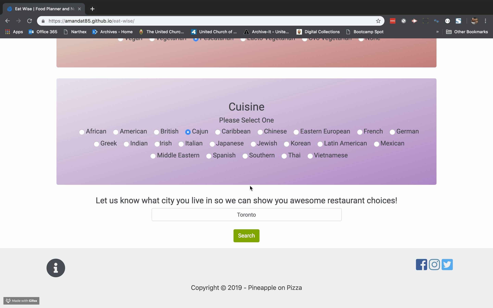

# Eat Wise
Food and Nutrition Application. Project One for Full Stack Web Development Bootcamp. Developed by Pineapple on Pizza (also known as Team 2).

## Site
https://amandat85.github.io/eat-wise/

## Languages and Tools Used
* HTML
* Bootstrap
* Javascript
* jQuery
* CSS
* SASS
* AJAX
* Font Awesome
* Google Fonts
* Firebase
* API

## Requirements
- [x] Two APIs
- [x] AJAX Pull
- [x] New Library or Technology
- [x] Polished UI
- [x] Good Coding Standards
- [x] No alerts, confirms or prompts
- [x] Repeating Element
- [x] Bootstrap or Alternative CSS Framework
- [x] User Input Validation
- [x] Mobile Responsiveness
- [x] Deployed on Github Pages

## How it works
* Users select from a list of diertary requirements including: meal time, diet, intolerances, cuisine, and enter their city.
* The application provides 5 recipe and restaurant results meeting the users dietary criteria.

## Future Developments
* Authentication Integration
* Storage and Retrieval of User Data
* Google Maps Integration
* Geolocation Service Integration
* Meal Planner Integration
* Blog Page 

## License
* MIT

## Animated Gif

